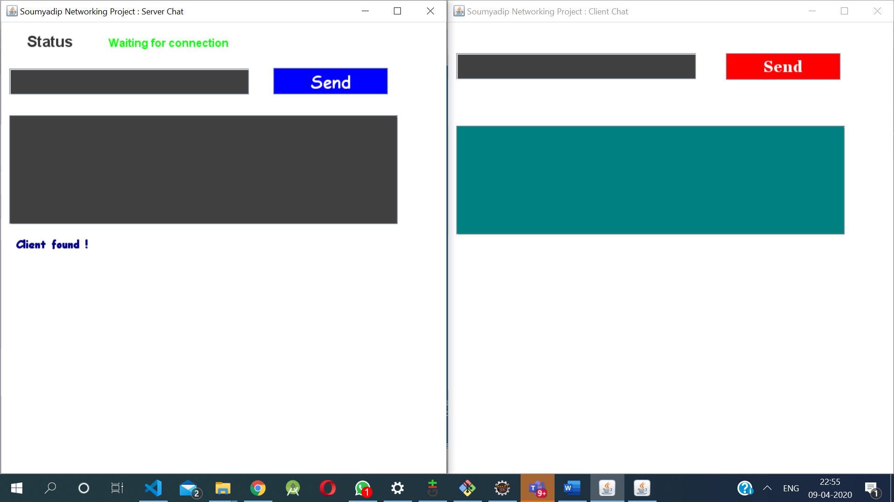
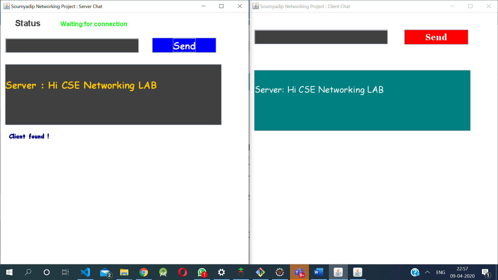
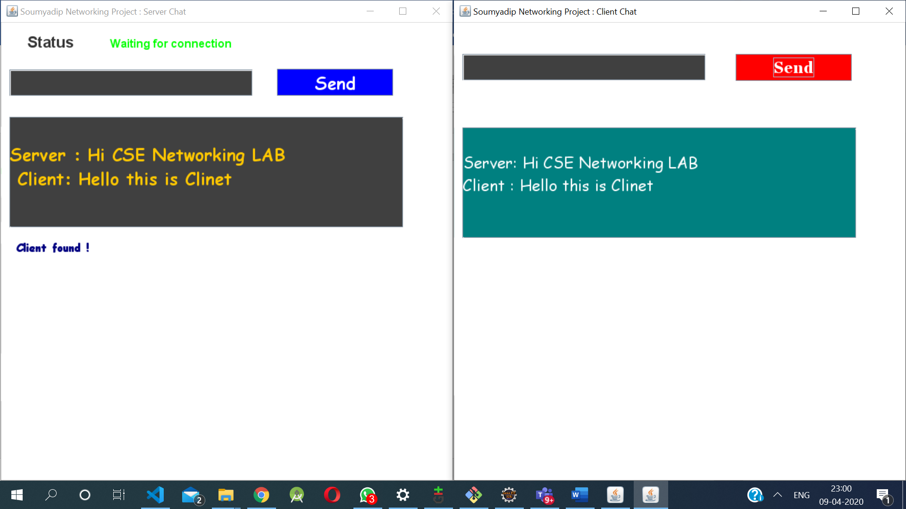
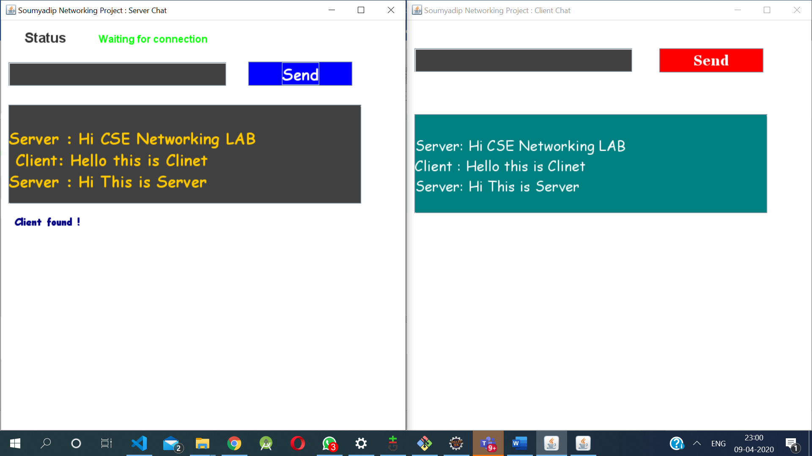
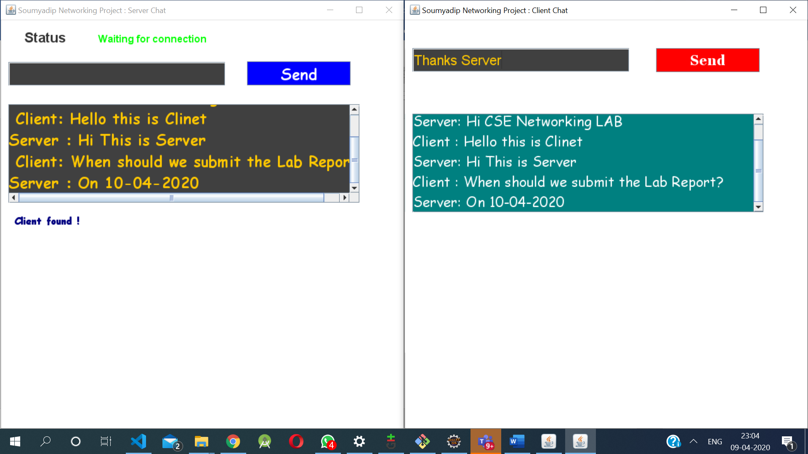
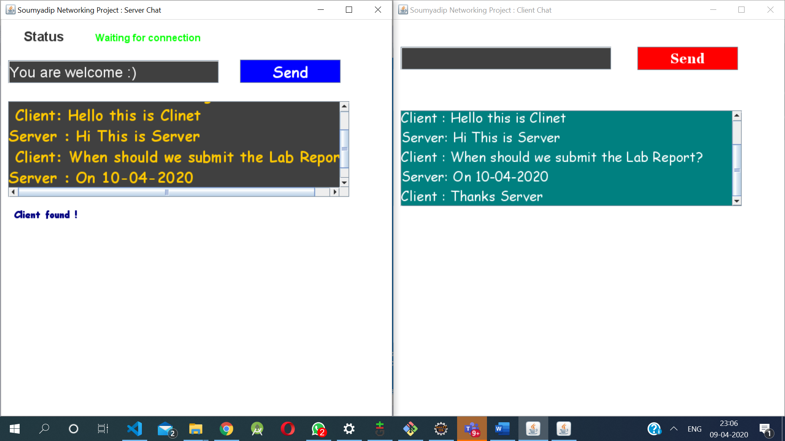

# 💬 NetTalk
Chat Server Application Using Java Swing & Sockets
A secure, multi-client **chat server application** developed using Java Swing, socket programming, and multithreading. This client-server architecture facilitates two-way communication between multiple clients over TCP, with a graphical interface for both server and client.

---

## 📖 Introduction

This project implements a **Client-Server Chat Application** using Java's `Socket` and `ServerSocket` APIs. The server runs continuously, accepting multiple client connections. Each client can send and receive real-time messages via a shared server.


## Project Structure 

ChatServerApp/
├── src/
│   ├── server/
│   │   ├── ChatServer.java
│   │   ├── ClientHandler.java
│   ├── client/
│   │   ├── ChatClient.java
│   │   ├── ClientUI.java
├── img/
│   ├── 1.png to 8.png


> The project demonstrates core concepts of:
- TCP/IP networking
- Thread-based concurrency
- Java Swing GUI components

---

## ⚙️ Technologies Used

- 💻 **Java SE**
- 🧵 **Multithreading**
- 📡 **TCP Sockets (Socket & ServerSocket)**
- 🖼️ **Java Swing (GUI)**
- 📂 **NetBeans / IntelliJ IDEA compatible**

-
# BACKGROUND OF THE STUDY 
Client server model is the standard model which has been accepted by many for developing security network applications. In this model, there is a notion of client and notion of server. 


A chat application is basically a combination of two applications: 
•	Server application 
•	Client application 


Server application runs on the server computer and client application runs on the client computer (or the machine with server). In this chat application, a client can send data to anyone who is connected to the server. 
Python application programming interface (API) provides the classes for creating sockets to facilitate program communications over the security network. Sockets are the endpoints of logical connections between two hosts and can be used to send and receive data. Python treats socket communications much as it treat input and output operations; thus programs can read from or write to sockets as easily as they can read from or write to files. 


To establish a server connection, a server socket needs to be created and attached to a port, which is where the server listens for connections. The port recognizes the Transmission Control Protocol service on the socket. For instance, the email server runs on port 25, and the web server usually runs on port 8080. 


Server Execution: At server the side, a thread is created which receives numerous clients’ requests. It also contains a list in which Client’s name and IP addresses are stored. When a client logs out, the server deletes that particular client from the list and updates the list 


Client Execution: A client firstly must have to register itself by sending username to the server and then any of two registered clients can communicate with each other. 

# DEFINITION OF TERMS 

Socket: Socket is a standard connection protocol that supports data communication over the security network between connected terminals. The standard connection supports the data transmission both by the TCP and UDP protocols between the terminals. 

TCP: TCP is a transport layer protocol used by applications that require guaranteed delivery of data. Basically, it is a connection oriented protocol. To communicate over TCP one must first have to establish a connection between pair of sockets, where one socket is client and the other belongs to server. After the connection is established between them then they can communicate with each other. 

Client: A client is a system that accesses or desires for a service made accessible by a server. 

Server: A server is a system (hardware or software) program running to provide the service requests of other system programs. 

Port: Port is a software mechanism that allows the centralized connected Servers to listen for requests made by clients. Port is actually purposed as a gateway to listen for the requested parameters by the server terminals or other machines. It is a software address on a system that is on the security network. Entire request response proceeding among this Application is carries through machine ports. 

/**
 * 
 * @author Rohan M Pednekar
 * @github Rohan143-mp

 *
 */


### Key Components:
- **Message Processor**: Parses messages from the sender.
- **Message Interpreter**: Extracts and routes messages.
- **Message Maker**: Constructs messages to send.
- **Client Manager**: Maintains active users and their info.

---

## 🧪 How It Works

1. **Server Execution**:
   - Starts and listens on a specified port.
   - Accepts incoming client requests.
   - Maintains a live list of connected clients.

2. **Client Execution**:
   - Sends a username to register with the server.
   - Communicates with other clients via the server.

---

## 🖥️ Screenshots

| Server GUI | Client Login | Chat Window |
|------------|--------------|-------------|
|  |  |  |
|  |  |  |
|  |  |

---

## 📚 Definitions

| Term | Description |
|------|-------------|
| **Socket** | Endpoint for communication between two machines. |
| **TCP** | Connection-oriented protocol ensuring reliable delivery. |
| **Client** | Initiates communication with the server. |
| **Server** | Waits for client requests and responds. |
| **Port** | A communication endpoint. |
| **Swing** | GUI toolkit for Java. |

---

## 🔐 Security Concepts

- **SSL (Secure Sockets Layer)** can be optionally implemented for secure data transmission.
- **IP & Port Management** ensures logical addressing and communication routing.

---

## 🚀 How to Run

### 🧱 Prerequisites

- JDK 8 or later
- Java IDE (IntelliJ IDEA, NetBeans, Eclipse)

### 🔧 Setup Steps

1. Clone the repo:
   ```bash
   git clone https://github.com/yourusername/Chat-Server-App.git
